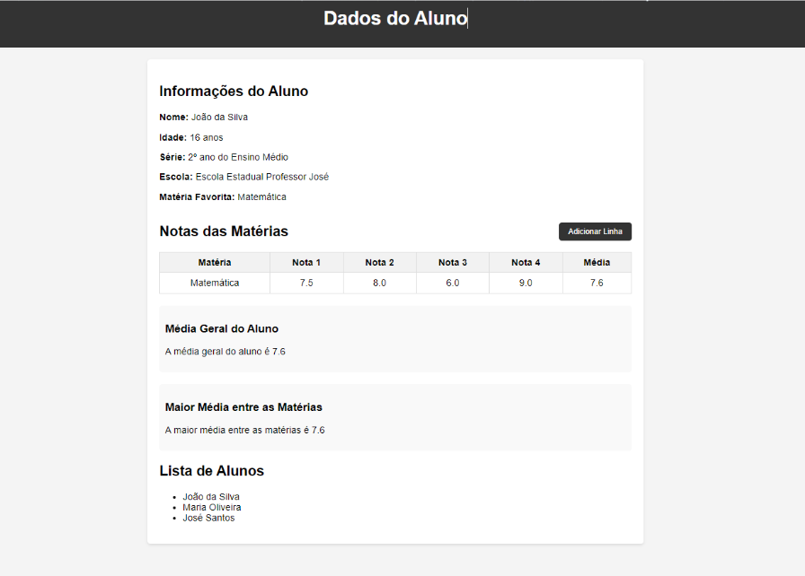

<h1 align="center"> Módulo 2 - Mini Projeto 01 </h1>

**_FullStack [Education] - FMT: Floripa Mais Tech_**

## Desenvolvedores
- Breno dal Bello
- David Alves
- João Cypriano
- Leonardo Vieira
- Marcos Vinicios

### Lider
- Breno Dal Bello

### Grupo
- Melancia

## Descrição
Desenvolvimento de uma plataforma de acompanhamento de notas de um aluno em específico.

## Atividades
- [x] [Ex 1 - Interface]
- [x] [Ex 2 - Coleta de Dados do Aluno]
- [x] [Ex 3 - Preenchimento dos Dados do Aluno]
- [x] [Ex 4 - Adicionar Materia]
- [x] [Ex 5 - Media Geral por Materia]
- [x] [Ex 6 - Media Geral do Aluno]
- [x] [Ex 7 - Maior Media entre as Materias]

## [M2S05] Ex 1 - Interface
Criação da interface conforme imagem abaixo:  

## [M2S05] Ex 2 - Coleta de Dados do Aluno
Assim que a página carregar, deverá ser executado o método para introdução dos dados do aluno:  
- Qual o nome do aluno?
- Qual a idade do aluno?
- Qual a série do aluno?
- Qual o nome da escola?
- Qual a sua matéria favorita?

## [M2S05] Ex 3 - Preenchimento dos Dados do Aluno
Complementar o Exercício 2 substituindo os textos de informações do aluno, apresentados no Exercício 1, pelos digitados no prompt.  
**A captura deverá ser feita por Id.**

## [M2S05] Ex 4 - Adicionar Materia
Na interface citada no exercício 01, observe o botão com o texto “Adicionar Linha” e aplique o seguinte fluxo:  

1. Ao clicar no botão, pergunte qual a matéria deseja cadastrar.
2. Após isso, perguntar as 4 notas com o laço while e montar o objeto citado no exercício 06 da semana 03.
3. Além disso, envie como parâmetro da função criada no exercício 01 da semana 03 a propriedade notas para que seja calculada a média.
4. Por último, adicione mais uma linha na tabela na interface produzida no primeiro exercício dessa semana.

**Dica:** Para esse último passo deve ser criado mais uma função no mesmo código javascript que os demais. Capture a tag <tbody>, e com o operador de reatribuição (+=) adicione mais uma tag <tr> com innerHTML.  
Lembre-se também que dentro da tag <tr> deverá ter 6 tags <td> uma para cada coluna, sendo a última tag a média.  

A ideia é que. ao finalizar a primeira parte do código. ele adicione mais uma linha na tabela com os dados cadastrados.

## [M2S05] Ex 5 - Media Geral por Materia
Calcular a média geral de cada matéria cadastrada na tabela (para isso, faça uma modificação no exercício anterior para salvar todas as médias calculadas em um array de médias: utilize o .push() para adicionar); caso fique muito complexo, poderá ser criado um array fixo (ex: let array = [10,9,3,2]) para fazer esse cálculo.

## [M2S05] Ex 6 - Media Geral do Aluno
No card/setor, onde possui o texto “média geral do aluno”, na interface criada no primeiro exercício, capture com querySelector o valor numérico da média geral do aluno (7.6 no exemplo da interface) e, assim que carregar a página de script, deverá ser atualizado esse valor pelo resultado retornado do exercício anterior, ou seja, a média geral de todas as médias.  

**OBS:** Até o atual momento, toda vez que criar mais um registro na tabela não será necessário atualizar esse valor. Deixaremos para fazer isso mais futuramente.

## [M2S05] Ex 7 - Maior Media entre as Materias
Por último, chame uma função que recebe um array de números e retorna o maior número dentre eles (utilize um qualquer laço de repetição) e substitua o texto no card/setor “Maior média entre as matérias” pela média que retornar nessa função do exercício 07. Nele, era necessário passar um parâmetro que era um array de médias, logo, poderá ser usado ou um array fixo ou o array de médias.